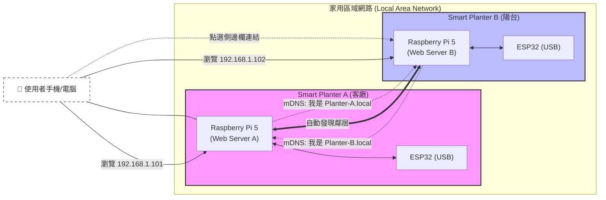

# ADR 001: 採用去中心化網頁架構與 mDNS 服務發現

**狀態：** 已接受 (Accepted)
**日期：** 2026-02-02
**參與者：** User, Gemini (AI Assistant)

## 背景 (Context)

Smart Planter 專案旨在開發一款具備 AI 人格的智慧盆栽。在初期設計中，曾考慮過多種系統架構，包括使用中央雲端伺服器、手機 App 綁定等方式。然而，專案核心硬體為 Raspberry Pi 5 (Server) + ESP32 (Sensor)，且主要使用場景為家庭區域網路 (Home LAN)。

我們需要決定一種架構，既能簡化開發（避免維護雲端與 App），又能提供良好的多裝置管理體驗。

## 決策 (Decision)

我們決定採用 **「完全去中心化的 Web Server 架構 (Decentralized Web Architecture)」**，並搭配 **mDNS (Multicast DNS)** 進行服務發現。

### 架構圖解 (Decentralized & mDNS)

### 詳細設計：

1.  **單機獨立運作 (Self-Hosted)**：
    *   每一台 Raspberry Pi 系統都是完整的（Full Stack），包含 FastAPI、SQLite、以及 Jinja2 前端。
    *   **拒絕雲端**：不依賴任何外部伺服器。
    *   **拒絕前後端分離**：前端直接由 Pi 渲染，不部署至 Netlify，避免跨域 (CORS) 問題。

2.  **裝置身分與綁定**：
    *   **移除 QR Code 綁定**：QR Code 僅作為實體標籤，供手機掃描後快速連入裝置網址 (Quick Access)。
    *   **初始化設定**：首次開機直接在網頁設定管理員密碼。

3.  **多裝置管理 (Service Discovery)**：
    *   **mDNS (Zeroconf)**：裝置開機後自動廣播 `hostname.local`。其他裝置透過 `zeroconf` 監聽廣播，自動將新發現的鄰居加入導覽列表。
    *   **P2P 同步**：裝置間可透過簡單的 HTTP API 同步彼此的狀態（例如：在 A 頁面看到 B 盆栽目前是否缺水）。

4.  **為什麼不使用 MQTT？**
    *   **硬體連線特性**：ESP32 與 Pi 是透過 **USB Serial (有線)** 直接連接，通訊極度穩定且延遲低，無需經過網路層。
    *   **架構簡化**：MQTT 需要架設 Broker (如 Mosquitto)，在單機架構下會增加不必要的複雜度。
    *   **結論**：內部通訊採用 **UART Serial**，跨機通訊採用 **HTTP API**，足以滿足需求。

## 後果 (Consequences)

### 正面影響 (Pros)：
*   **隱私與安全**：所有數據（照片、對話紀錄）都只留在使用者家中的樹莓派裡，不需上傳雲端。
*   **開發簡化**：只需維護一套 Codebase，不需要開發 iOS/Android App，也不用寫雲端後端。
*   **無持續成本**：不需要支付雲端伺服器費用。
*   **硬體相容**：完美契合目前的「樹莓派 + ESP32」實體連接架構。

### 負面影響 (Cons)：
*   **遠端存取限制**：使用者若不在家（離開區網），無法直接控制盆栽（需自行設定 VPN 或內網穿透）。
*   **效能依賴**：網頁載入速度取決於樹莓派的效能（Pi 5 效能足夠，應無大礙）。

## 參考 (References)
*   相關 Use Case: `UC-01`, `UC-02`
*   技術關鍵字: `mDNS`, `Zeroconf`, `FastAPI`, `htmx`, `SQLite`
