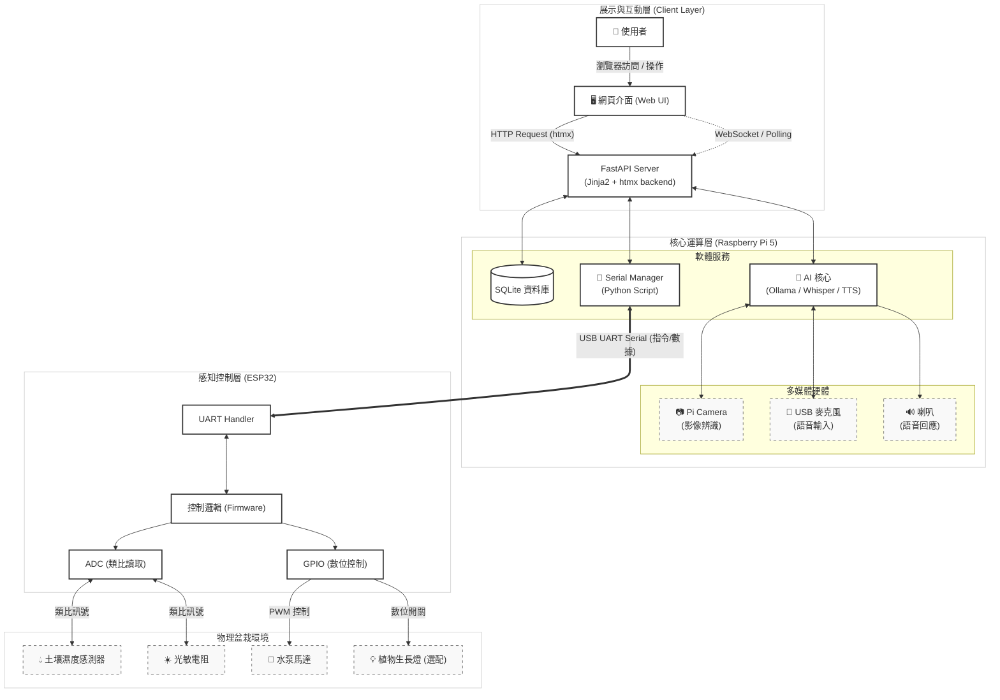

# 智慧盆栽 (Smart Planter) 系統架構

## 1. 架構圖 (System Architecture Diagram)

以下圖表展示了系統的三層架構：**展示層 (Client)**、**核心運算層 (Raspberry Pi)** 與 **感知控制層 (ESP32)**。

---

## 2. 模組職責說明

### A. 核心運算層 (Raspberry Pi 5)
這是系統的「大腦」與「感官中心」，負責高階邏輯運算。

*   **FastAPI Server**: 處理網頁請求，使用 Jinja2 渲染 HTML 片段回傳給前端 (htmx)。
*   **AI Core**: 
    *   **視覺**: 透過 **Pi Camera** 觀察植物外觀。
    *   **聽覺**: 透過 **麥克風** 接收使用者語音，使用 Whisper 轉文字。
    *   **思考**: 使用 **Ollama** 進行自然語言對話生成。
    *   **說話**: 透過 **喇叭** 播放 TTS 生成的語音。
*   **Serial Manager**: 負責與 ESP32 進行雙向通訊，解析感測數據並存入 SQLite。

### B. 感知控制層 (ESP32)
這是系統的「神經末梢」與「四肢」，負責接觸物理世界。

*   **ADC (Analog-to-Digital Converter)**: 讀取土壤濕度與光照強度的電壓變化，轉換為 0-4095 的數值傳給 Pi。
*   **GPIO / PWM**: 接收到 Pi 的指令後，開啟水泵進行澆水，或控制生長燈開關。
*   **UART Serial**: 透過 USB 線作為忠實的傳令兵，不進行複雜決策，只回報數據與執行命令。

### C. 物理配置 (Physical Layout)
*   **樹莓派與 ESP32** 應放置於盆栽旁的**防水控制盒**中。
*   **Pi Camera** 透過控制盒上的開孔或支架，對準植物主體。
*   **感測器與水管** 從控制盒延伸至土壤中。
